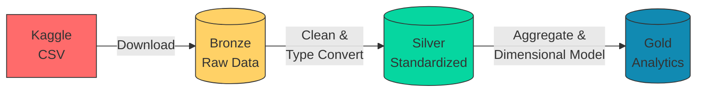

# Databricks_ETL_Pipeline

```mermaid
flowchart LR
    A[Kaggle\nCSV] -->|Download| B[(Bronze\nRaw Data)]
    B -->|Clean &\nType Convert| C[(Silver\nStandardized)]
    C -->|Aggregate &\nDimensional Model| D[(Gold\nAnalytics)]

    style A fill:#FF6B6B,stroke:#333
    style B fill:#FFD166,stroke:#333
    style C fill:#06D6A0,stroke:#333
    style D fill:#118AB2,stroke:#333
```
