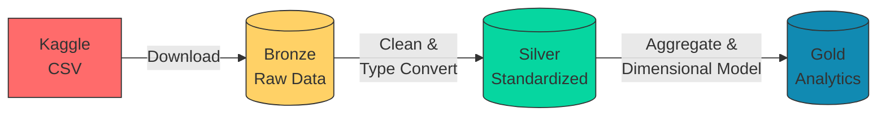

# Databricks_ETL_Pipeline

An end-to-end data pipeline processing San Francisco Fire Department call records from raw CSV files to analytical gold tables using Databricks and Delta Lake.

## 📌 Project Overview

This project implements a medallion architecture (bronze-silver-gold) to transform raw fire department call data into structured analytics-ready tables. The pipeline handles:
- Data ingestion from Kaggle
- Null value handling and type conversion
- Temporal analysis and aggregation
- Delta Lake optimizations

## 📂 Dataset Description

**Source**: [SF Fire Department Calls on Kaggle](https://www.kaggle.com/datasets/imankity/san-francisco-fire-department-public-dataset)  
**Original Source**: [SF OpenData](https://data.sfgov.org/Public-Safety/Fire-Department-Calls-for-Service/nuek-vuh3)  
**Size**: 1.77GB CSV (34 columns)  
**Records**: ~5.3 million calls  

**Key Fields**:
- Call metadata: `Call Number`, `Incident Number`
- Temporal data: `Call Date`, `Received DtTm`, `On Scene DtTm`
- Location data: `Address`, `City`, `Zipcode`
- Operational data: `Call Type`, `Priority`, `ALS Unit`

## 🏗️ Pipeline Architecture

